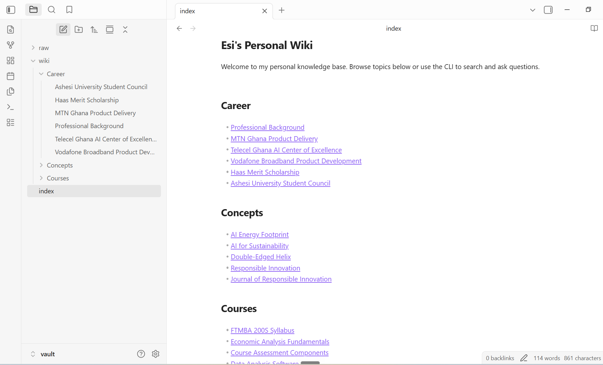
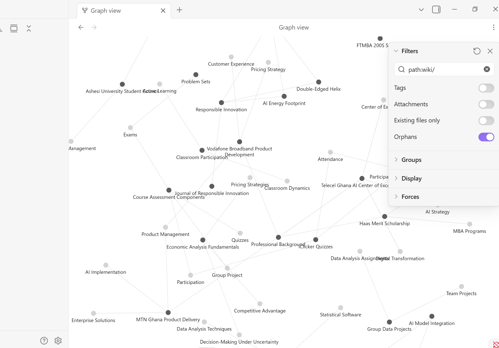

# Esi's Personal Wiki CLI

A personal knowledge base CLI powered by local Gemma via Ollama with RAG (Retrieval Augmented Generation). Built as a standalone harness that manages chat, ask, and search modes — all working offline after initial setup.

## Purpose and Sources

This wiki organizes personal knowledge from MBA coursework, career experience, and AI research into a browsable, searchable knowledge base. The CLI uses a local language model to generate wiki pages, answer questions with citations, and provide a conversational assistant.

**Sources (4 documents):**

| Source | Description |
|--------|-------------|
| `AI & Sustainability.txt` | Academic paper on the AI sustainability paradox — energy, water, agriculture, smart cities |
| `CLAUDIA ESI DENTU RESUME.txt` | Professional background — product management at MTN & Telecel, Berkeley Haas MBA |
| `Data and Decisions Syllabus.txt` | FTMBA 200S statistics course — sampling, regression, ML, AI policy |
| `FTMBA 201A Economic Analysis Syllabus.txt` | Microeconomics course — costs, pricing, game theory, oligopoly |

Original sources are preserved unchanged in `vault/raw/`. Generated wiki pages live in `vault/wiki/` with short descriptive filenames, matching headings, source references, and internal links.

## Device Specs

| Spec | Value |
|------|-------|
| OS | Windows 11 Pro |
| CPU | AMD Ryzen 7 PRO 7840U |
| RAM | 14.7 GB total |
| GPU | AMD Radeon 780M (integrated, shares system RAM) |
| Free Disk | ~352 GB |

## Setup

### Prerequisites

- Python 3.10+
- [Ollama](https://ollama.com) for Windows
- [Obsidian](https://obsidian.md) (for browsing the wiki)

### 1. Install Ollama and Pull Gemma

```bash
# Download and install Ollama from https://ollama.com
# Then pull the model:
ollama pull gemma3:4b
```

### 2. Create Python Environment

```bash
cd "Esi's Wiki"
python -m venv .venv

# Windows:
.venv\Scripts\activate

# Install dependencies:
pip install -r requirements.txt
```

### 3. Download Embedding Model (while online)

ChromaDB uses its built-in ONNX embedding model (all-MiniLM-L6-v2) which downloads automatically on first use (~80 MB). Run a quick test to cache it:

```bash
python -c "import chromadb; c = chromadb.Client(); col = c.get_or_create_collection('test'); col.add(ids=['1'], documents=['test']); print('Embedding model cached.')"
```

Confirm the model is downloaded before going offline.

### 4. Verify Setup

```bash
# Check Ollama is running:
ollama list

# Test the CLI:
python wiki.py --help
```

## Model Choice

| Setting | Value |
|---------|-------|
| Model | Gemma 3 4B Instruct (gemma3:4b) |
| Quantization | Q4_0 (~4.5 GB) |
| Runtime | Ollama |
| Embedding | all-MiniLM-L6-v2 (ChromaDB built-in ONNX, ~80 MB) |
| Vector Store | ChromaDB (persistent, local) |

**Why Gemma 3 4B?** With 14.7 GB total RAM on an integrated AMD APU, the 4B model (~4.5 GB at Q4) leaves sufficient headroom for the OS, runtime, embedding model, and ChromaDB. It provides better response quality than the 1B model while staying within memory limits. The 26B MoE model requires ~14.4 GB at Q4 which would exceed available memory.

**Measured performance:**

| Metric | Value |
|--------|-------|
| Model memory (llama-server RSS) | ~3.4 GB |
| Total system RAM used | ~12.3 GB of 14.7 GB |
| Ingestion (4 sources, 82 passages, 21 pages) | ~3-5 min |
| Ask-mode query (retrieve + generate) | ~5-10 sec |
| Search-mode query (ChromaDB only) | <1 sec |
| Chat-mode response | ~5-15 sec |

## CLI Commands

```bash
# Ingest sources and generate wiki pages:
python wiki.py ingest ./vault/raw

# Search for passages (no LLM needed):
python wiki.py search "pricing strategy"

# Ask a factual question with citations:
python wiki.py ask "What is the AI policy for MBA courses?"

# Save evidence card:
python wiki.py ask "How is the Economic Analysis course graded?" --save data/evidence/test2.md

# Start interactive chat:
python wiki.py chat

# Show help:
python wiki.py --help
```

## Architecture

```
User Command
    │
    ▼
┌─────────────────────────────────────────────────┐
│  CLI (wiki.py)                                  │
│  Parses command, selects mode                   │
└──────────┬──────────┬──────────┬────────────────┘
           │          │          │
     ┌─────▼──┐  ┌────▼───┐  ┌──▼─────┐
     │  Chat  │  │  Ask   │  │ Search │
     │  Mode  │  │  Mode  │  │  Mode  │
     └───┬────┘  └───┬────┘  └───┬────┘
         │           │           │
         ▼           ▼           ▼
┌─────────────┐ ┌─────────┐ ┌──────────────┐
│ Personality │ │ Research│ │ Passages     │
│ + Context   │ │ Rules   │ │ Only         │
│ + Optional  │ │ + RAG   │ │ (No LLM)     │
│   Retrieval │ │ Always  │ │              │
└──────┬──────┘ └────┬────┘ └──────┬───────┘
       │             │             │
       ▼             ▼             │
┌──────────────────────────┐       │
│  Model (harness/model.py)│       │
│  Ollama → Gemma 3 4B     │       │
└──────────────────────────┘       │
       │             │             │
       ▼             ▼             ▼
┌──────────────────────────────────────┐
│  Retrieval (harness/retrieval.py)    │
│  ChromaDB (ONNX embeddings)         │
└──────────────────────────────────────┘
```

### How It Works

1. **Mode selection:** The CLI (`wiki.py`) parses the user's command and routes to the appropriate mode handler.

2. **Chat mode** loads personality from `config/persona.md`, maintains conversation history in memory, and retrieves wiki passages only when the message references wiki topics (detected via keyword matching). Follow-ups like "make that shorter" use conversation context. Citations are added for claims from notes; suggestions are labeled as such.

3. **Ask mode** loads research rules from `config/wiki-instructions.md`. Each question is standalone (no chat history). It always retrieves the top-5 passages, builds a prompt with evidence, and generates a neutral answer with citations. If evidence is insufficient, it says so.

4. **Search mode** queries ChromaDB directly and displays matching passages with source paths and relevance scores. No model generation — works without Ollama running.

5. **Ingestion** reads source files from `vault/raw/`, splits text into ~1500-character passages with overlap, indexes them in ChromaDB, then sends source text to Gemma to generate wiki pages. Pages get short descriptive filenames, matching headings, source references, and related-note links. A source catalog (`data/source_catalog.yaml`) tracks what was generated, preventing duplicates on re-ingestion.

### Tracing a Question Through the Harness

Example: `python wiki.py ask "Where is the workshop?"`

1. **CLI routing** (`wiki.py:ask`): Click parses the command and calls `run_ask(question, model, retrieval, save_path)`.
2. **Load instructions** (`harness/ask_mode.py`): Reads `config/wiki-instructions.md` — neutral research rules with citation requirements.
3. **Retrieve passages** (`harness/retrieval.py:search`): Queries ChromaDB with `query_texts=[question]`, gets top-5 passages ranked by cosine similarity. Each result includes text, source path, section, and relevance score.
4. **Build prompt** (`harness/ask_mode.py`): Assembles system prompt (research rules) + retrieved passages formatted as `[Source: filename, section]: text` + the user's question.
5. **Call Gemma** (`harness/model.py:generate`): Sends the assembled prompt to `ollama.generate(model="gemma3:4b", ...)`. Returns the generated text.
6. **Display and save** (`harness/ask_mode.py`): Prints the answer in a Rich Panel. If `--save` was passed, writes an evidence card with question, passages, answer, and assessment fields.

Chat mode differs at steps 2-3: it loads `config/persona.md` instead, maintains a conversation history list, and only retrieves when `_needs_retrieval()` keyword matching triggers a search. Search mode stops at step 3 — it displays the raw passages and never calls the model.

### Design Choices

| Choice | Decision | Rationale |
|--------|----------|-----------|
| Passage size | ~1500 chars, 200 overlap | Balances context richness with retrieval precision |
| Retrieval top-k | 5 passages | Enough context for multi-source answers without overwhelming the model |
| Chat retrieval | Keyword-triggered | Avoids unnecessary lookups for casual conversation |
| Chat history | Last 20 messages | Keeps context manageable for the 4B model's window |
| Wiki filenames | 2-6 word Title Case | Readable in Obsidian graph and file list |
| Instructions | Separate files | `persona.md` for chat, `wiki-instructions.md` for ask — keeps modes distinct |
| Index structure | `vault/index.md` | Topic-organized landing page with wiki links |
| Chunks storage | `data/chroma/` outside vault | Keeps retrieval artifacts out of Obsidian |

## Evidence

### Ask-Mode Test Questions

| Test | Question | Expected Source | Evidence Card |
|------|----------|-----------------|---------------|
| 1 | "What is the estimated global data-center electricity demand by 2030?" | AI & Sustainability.txt | [test1.md](data/evidence/test1.md) |
| 2 | "How is the Economic Analysis course graded?" | FTMBA 201A Syllabus | [test2.md](data/evidence/test2.md) |
| 3 | "What is the AI usage policy for MBA courses at Berkeley Haas?" | Both syllabi | [test3.md](data/evidence/test3.md) |
| 4 | "What is Esi's GPA at Berkeley Haas?" | None (unsupported) | [test4.md](data/evidence/test4.md) |

### Mode Checks

- [Chat mode check](data/evidence/chat_check.md) — "what can you help me with?" + follow-up draft
- [Search mode check](data/evidence/search_check.md) — search "pricing" for raw passages

### Source Catalog and Note Tracing

The source catalog ([source_catalog.yaml](data/source_catalog.yaml)) maps each original source to its generated wiki pages and passage count:

```
AI & Sustainability.txt → 5 wiki pages, 12 passages
CLAUDIA ESI DENTU RESUME.txt → 6 wiki pages, 7 passages
Data and Decisions Syllabus.txt → 5 wiki pages, 43 passages
FTMBA 201A Economic Analysis Syllabus.txt → 5 wiki pages, 20 passages
```

**Trace example:** Start at [index.md](vault/index.md) → click [[MTN Ghana Product Delivery]] → note shows source reference `CLAUDIA ESI DENTU RESUME.txt` → follow `[[Telecel Ghana AI Center of Excellence]]` related link → trace back to the same resume source in `vault/raw/`.

**Re-ingestion test:** Re-ingesting `AI & Sustainability.txt` kept the passage count at 82 (old passages cleared, new ones added for the same source). The source catalog updated to reflect the new page set. No duplicate passages or orphaned pages were created.

### Offline Demonstration

All components run locally after initial setup — no internet required:

- **Ollama + Gemma 3 4B:** Runs entirely on local CPU/GPU, no API calls
- **ChromaDB + ONNX embeddings:** Embedding model cached locally (~80 MB), vector store persisted to `data/chroma/`
- **Search mode:** Works without even Ollama running (queries ChromaDB directly)

**[Offline demonstration log](data/evidence/offline_demo.md)** — all four ask-mode tests, search mode, and help captured with internet disconnected.

To reproduce: disconnect WiFi/Ethernet, then run:

```bash
python offline_test.py
```

This runs all tests and saves the output to `data/evidence/offline_demo.md` with an internet connectivity check at both start and end.

## Obsidian Screenshots

To view the wiki in Obsidian, select "Open folder as vault" and choose the `vault/` directory.

### 1. Wiki Note with Source References and Related Links


### 2. Topic-Organized Index



### 3. Graph View



## Reflection

### Limitation

The 4B model struggles with **cross-source evidence conflation**. In Test 2, the model was asked about Economic Analysis grading and returned the Data & Decisions grading breakdown (10%/50%/40%) while citing the Economic Analysis syllabus. When multiple sources appear in the retrieved passages, the small model sometimes mixes facts between them rather than correctly attributing each detail to its source. This also appeared in Test 3, where the model answered using only one syllabus's AI policy instead of synthesizing both. The limited parameter count means the model cannot always distinguish which passage each fact came from when multiple sources are interleaved in the prompt.

### Fix Attempted

**Source-separated prompting** was implemented in `harness/ask_mode.py`: retrieved passages are now grouped by source document with clear `=== Source: filename ===` headers and a prompt instruction not to mix facts between sources. This partially improved Test 2 — the model now correctly attributes Data & Decisions grading numbers to their actual source instead of misattributing them to FTMBA 201A. However, the model still includes both courses' grading in one answer rather than filtering to the relevant source only.

### Proposed Further Improvement

A **re-ranking step** using a lightweight cross-encoder could score passage-question relevance more precisely than cosine similarity alone, filtering out marginally relevant passages from unrelated sources before they reach the model. For Test 2, this would likely drop the Data & Decisions grading passage (43% relevance) before it reaches the prompt, leaving only FTMBA 201A passages for the model to work with.

## Project Structure

```
Esi's Wiki/
├── wiki.py                    # CLI entry point
├── harness/
│   ├── __init__.py
│   ├── model.py               # Ollama interface
│   ├── retrieval.py           # Embedding + vector search
│   ├── chat_mode.py           # Chat mode logic
│   ├── ask_mode.py            # Ask mode logic
│   ├── search_mode.py         # Search mode logic
│   ├── ingest.py              # Ingestion pipeline
│   └── utils.py               # Text splitting utilities
├── config/
│   ├── persona.md             # Chat personality
│   └── wiki-instructions.md   # Research rules
├── vault/                     # Obsidian vault root
│   ├── raw/                   # Original sources (unchanged)
│   ├── wiki/                  # Generated wiki pages
│   │   ├── Concepts/
│   │   ├── Courses/
│   │   └── Career/
│   └── index.md               # Landing page
├── data/
│   ├── chroma/                # Vector store (gitignored)
│   ├── source_catalog.yaml    # Source → page mapping
│   └── evidence/              # Test results
├── requirements.txt
└── README.md
```
